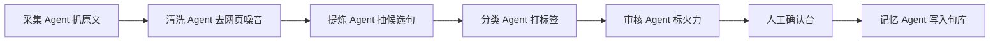
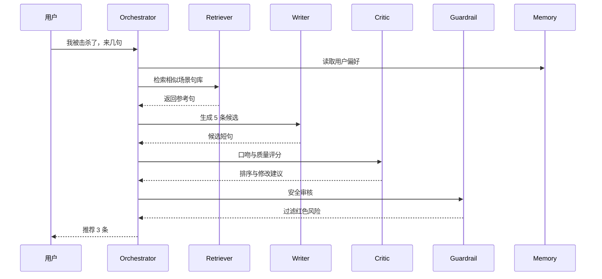

# 仅予你的晴天网站 Agent 架构设想

这个项目可以从“句库工具”进化成“游戏发言素材 Agent 工作台”。核心不是堆模型，而是把采集、判断、改写、审核、推荐拆成可追踪的协作链路。

## 当前可落地的 Agent 流水线

1. 采集 Agent
   - 输入：公众号链接、网页链接、手动粘贴文本
   - 输出：原文片段、候选短句、过滤记录
   - 关键能力：识别网页噪音、公众号提示、广告、菜单、教程步骤

2. 提炼 Agent
   - 输入：原文正文
   - 输出：可直接复制的短句
   - 关键能力：只保留像玩家会说的话，避免“预览时标签不可点”这类噪音入库

3. 分类 Agent
   - 输入：短句
   - 输出：场景、语气、火力等级、判断依据
   - 关键能力：把短句归入被击杀、反杀、队友名场面、逆风翻盘等场景

4. 变体 Agent
   - 输入：原句 + 风格目标
   - 输出：成语典故版、阴阳怪气版、清新自嘲版、王者嘴替版、降火文明版
   - 关键能力：同义改写，但保持玩家口吻，不要 AI 腔

5. 审核 Agent
   - 输入：候选短句或变体
   - 输出：绿色、黄色、红色，附风险原因
   - 关键能力：避免辱骂、人身攻击、过度挑衅，给“降火版本”

6. 推荐 Agent
   - 输入：当前场景、历史复制、收藏、最近使用
   - 输出：最适合马上复制的 3 到 5 条
   - 关键能力：根据你常用口味排序，越用越懂你

## 进阶版：多 Agent 编排

可以把一次链接采集设计成这样：

这个结构的好处是每一步都能解释：为什么选这句，为什么丢那句，为什么判成黄色火力。所谓“知其然，亦知其所以然”。

## 高级版：记忆与风格画像

后续可以加一个“风格画像”：

- 记录常复制的语气：成语典故、阴阳怪气、清新自嘲
- 记录常用场景：被击杀、队友离谱、逆风
- 记录不用的句子：你删掉或取消勾选的内容
- 形成个人偏好：少废话、少标点、偏古风、偏抽象、偏文明

这样推荐 Agent 就不是随机抽句，而是有“旧雨新知”的记忆。

## 更复杂的生产级方案

1. Orchestrator Agent
   - 负责任务拆解，决定调用哪些 Agent
   - 例如链接采集走“采集 -> 提炼 -> 分类 -> 审核”
   - 变体生成走“变体 -> 审核 -> 去重”

2. Tool Agent
   - 专门调用外部工具，比如网页抓取、KV 同步、导入导出
   - 保证模型不直接碰存储，减少误操作

3. Critic Agent
   - 对生成结果挑刺
   - 判断是否像玩家口吻、是否太 AI、是否太长、是否有攻击性

4. Memory Agent
   - 管理长期偏好和使用历史
   - 可以存在 Cloudflare KV 或后续换 D1/Supabase

5. Guardrail Agent
   - 做安全边界
   - 拦掉红色攻击、隐私、人身辱骂

6. Evaluator Agent
   - 给候选打分
   - 维度：好笑、短、贴场景、可复制、安全、是否重复

最终一次“生成嘴替”可以变成：

## 推荐实施顺序

1. 先把当前的采集、变体、快捷场景打磨稳定
2. 加“过滤记录可恢复”，允许把被过滤句手动转为候选
3. 加“复制历史”，让推荐 Agent 有记忆
4. 加“风格画像”，让网站慢慢学你的说话习惯
5. 后端从单 Worker 升级为 Worker + KV + D1，保留可解释日志

这条路线比较稳：先有好用体验，再长出复杂架构。否则容易“筑室道谋”，图很漂亮，用起来却不顺手。
